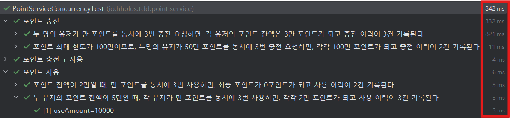

# 포인트 충전 시스템
이 프로그램은 사용자 포인트 관리 기능을 제공합니다. 주요 기능은 다음과 같습니다.
- 포인트 충전: 사용자가 자신의 계정에 포인트를 충전할 수 있습니다.
- 포인트 조회: 현재 계정의 잔여 포인트를 확인할 수 있습니다.
- 포인트 사용: 필요한 만큼 포인트를 차감하여 사용할 수 있습니다.
- 포인트 사용 이력 조회: 특정 유저의 포인트 충전, 사용 내역을 확인할 수 있습니다.

## 요구사항 정리
- [x] 포인트는 0 이상 100만 이하의 값을 가진다
- [x] 특정 유저의 포인트를 조회한다
- [x] 특정 유저가 포인트를 충전한다
    - [x] 포인트는 양의 정수만 충전 가능하다
    - [x] 포인트 충전 시, 고객의 포인트가 100만 포인트를 초과해선 안된다
    - [x] 포인트 충전 시, 포인트가 증가한다
    - [x] 포인트 충전 시, 포인트 사용 이력이 추가된다
    - [x] 여러 사용자가 동시에 동일 계정에 포인트 충전 시, 정상 처리 되어야 한다.
- [x] 특정 유저가 포인트를 사용한다
    - [x] 특정 유저의 포인트 잔액이 포인트 사용 금액보다 적으면 사용할 수 없다
    - [x] 포인트 사용 시, 포인트가 감소한다
    - [x] 포인트 사용 시, 포인트 사용 이력이 쌓인다
    - [x] 여러 사용자가 동시에 동일 계정에 포인트 사용 시, 정상 처리 되어야 한다.
- [x] 특정 유저의 포인트 사용 이력을 조회한다

## 동시성 제어 방식 및 각 적용의 장단점 분석
멀티스레드 환경에서 동시에 포인트를 충전하거나 사용할 때
즉, 공유 자원에 동시에 접근하는 상황에 발생할 때 기대하는 결과가 나오지 않는 상황이 발생했다.
아래와 같은 단계로 동시성 이슈를 해결하였다.

### 메모리 기반의 동시성 제어 방식

### 1. Synchronized(this)
- 모든 스레드가 순차적으로 동작하기에 동시성 이슈가 발생하지 않는다
- 테스트 결과 : `총 863ms`
  .png)
- 장점
  - 스레드가 대기하는 동안 CPU 사용하지 않기에 CPU 리소스가 적게 소모된다
- 단점
  - 스레드의 컨텍스트 스위칭 비용이 있다.
  - 락 획득을 못한 스레드는 대기하기에 성능이 안좋다.

#### 2. Synchronized(userId)
```
synchronized(id.toString().intern()) {...}
```
- Synchronized 로 id별 락을 구현하였다
- Long은 synchronized에 사용할 수 없어서 id를 String으로 변환하였고
  <br> intern() 사용하여 동일한 문자는 String Constant Pool에서 가져오도록 하였다.

- 테스트 실행 결과 : `총 904.ms`
  .png)

`충격적이게도 Synchronized(this)보다 느리다는 결과가 나왔다.`

> 아이디별 Synchronized를 적용하여 `Synchronized(this)`보다 성능이 우수할 것으로 예상했지만, 테스트 결과 오히려 더 느린 성능을 보였다.<br>
> 여러 번 테스트를 반복하고, 스레드를 최대 만 개까지 늘려가며 실험해보았지만, 항상 더 느린 결과를 기록했다.<br><br>
> 검색해본 결과, 예상가는 이유는 `String Constant Pool 내부에서 진행하는 동기화 작업으로 인한 성능 저하였다.`<br>
> JVM 내부에서 String Constant pool 동시 접근을 내부적으로 관리하며<br>
> 멀티스레드 상황에서 intern()을 빈번하게 호출하면 String Constant pool 동기화 비용으로 인해 성능 저하 발생할 수 있다고 한다.

- 장점
  - 없다.
- 단점
  - 컨텍스트 스위칭 비용이 있다
  - Synchronized 특성 상, 락 범위를 세밀하게 제어할 수 없다.
  - 비공정 락만 사용 가능하다.
  - intern() 호출로 인한 JVM 동기화 비용으로 Synchronized(this)보다 느리다

### 3. ID별 ReentrantLock

- ConcurrentHashMap 을 사용하여 thread safe 하게 락을 저장하였다
- key : userId / value : ReentrantLock 으로 하여 아이디별 ReentrantLock 실행하도록 하였다
> ConcurrentHashMap<userId, ReentrantLock>
- 테스트 실행 결과 : `총 842.ms`

`가장 빠른 실행 결과를 확인하였다!!`
- 

- 장점
  - ID 별로 락을 걸기 때문에 여러 아이디에 동시에 요청이 들어오는 경우, Synchronized(this) 보다는 성능이 좋다
  - ReentrantLock 의 다양한 기능을 활용 가능 하다
    - 스핀락으로 변경 가능
      - 락 경합이 심하지 않을 경우에는 스핀락 성능이 더 좋다
    - 락 범위 명시적 지정 가능
    - 공정락, 비공정락 선택 가능
- 단점
  - id별 락 객체가 생성되기 때문에 메모리 사용량이 증가한다
  - 락 생성, 해제에 대한 관리가 필요하다
    - 랩핑 클래스를 만들어서 클래스 내부에서 락 생성, 해제를 하면 문제 없다.

### 최종 결론
`3. ID별 ReentrantLock`을 채택하게 되었다. <br>
테스트 실행 시, 가장 우수한 성능을 보여주며 ReentrantLock 을 이용한
개발 시 범용성도 좋다고 생각되어서 선택하게 되었다.